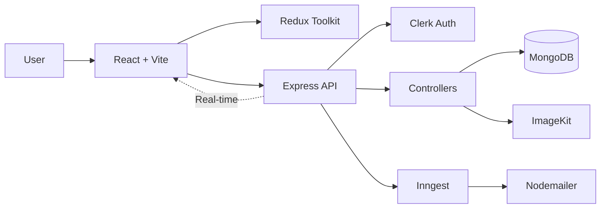
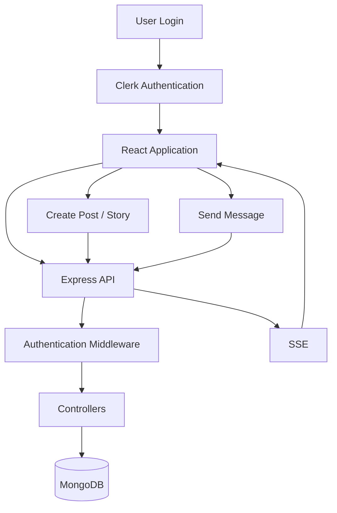

# Tether

A full-stack social media application where users can connect, share posts and stories, discover people, and chat in real time.

<p align="center">

[](https://react.dev/)
[](https://vite.dev/)
[](https://redux-toolkit.js.org/)
[](https://tailwindcss.com/)
[](https://nodejs.org/)
[](https://expressjs.com/)
[](https://www.mongodb.com/)
[](https://clerk.com/)

</p>

##  Features

*  User authentication with Clerk
*  User profiles and profile customization
*  Follow and connection system
*  Create and like posts
*  24-hour disappearing stories
*  Real-time one-to-one messaging
*  Image uploads and media handling
*  Notifications and background jobs
*  Email notifications

##  Tech Stack

**Frontend**

* React + Vite
* Redux Toolkit
* React Router
* Tailwind CSS
* Clerk
* Axios

**Backend**

* Node.js
* Express.js
* MongoDB + Mongoose
* Clerk
* Multer
* ImageKit
* Inngest
* Nodemailer

---

##  System Architecture



### Application Flow



---

##  Project Structure

```text
Tether/
├── client/          # React frontend
│   └── src/
│       ├── components/
│       ├── features/
│       ├── pages/
│       ├── api/
│       └── App.jsx
│
├── server/          # Express backend
│   ├── configs/
│   ├── controllers/
│   ├── middlewares/
│   ├── models/
│   ├── routes/
│   ├── inngest/
│   └── server.js
│
└── README.md
```

---

##  Installation

### 1. Clone the repository

```bash
git clone https://github.com/aroaannn/Tether.git
cd Tether
```

### 2. Setup Backend

```bash
cd server
npm install
```

Create `server/.env`:

```env
PORT=4000
MONGODB_URI=your_mongodb_uri
CLERK_SECRET_KEY=your_clerk_secret_key
IMAGEKIT_PUBLIC_KEY=your_imagekit_public_key
IMAGEKIT_PRIVATE_KEY=your_imagekit_private_key
IMAGEKIT_URL_ENDPOINT=your_imagekit_url
INNGEST_EVENT_KEY=your_inngest_event_key
INNGEST_SIGNING_KEY=your_inngest_signing_key
```

Run the server:

```bash
npm run server
```

### 3. Setup Frontend

Open another terminal:

```bash
cd client
npm install
```

Create `client/.env`:

```env
VITE_CLERK_PUBLISHABLE_KEY=your_clerk_publishable_key
VITE_BASEURL=http://localhost:4000
```

Run the frontend:

```bash
npm run dev
```

---

##  Real-Time Messaging

Tether uses **Server-Sent Events (SSE)** for real-time messaging.

```text
User A
   ↓
React Client
   ↓
Express API
   ↓
MongoDB
   ↓
SSE Connection
   ↓
React Client
   ↓
User B
```

This allows new messages to be pushed to connected users without repeatedly refreshing or polling the server.

---

##  Future Improvements

* Group chats
* Comments and post sharing
* Push notifications
* Typing indicators
* Online/offline status
* Advanced search

---

##  Author

**Aroan Victor**

